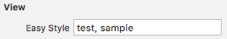
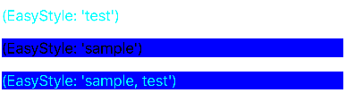

# TWKit

[](https://travis-ci.org/Keun young Kim/TWKit)
[](http://cocoapods.org/pods/TWKit)
[](http://cocoapods.org/pods/TWKit)
[](http://cocoapods.org/pods/TWKit)

## Installation

TWKit is available through [CocoaPods](http://cocoapods.org). To install
it, simply add the following line to your Podfile:

```ruby
pod 'TWKit'
```

OR

```ruby
pod 'TWKit/EasyStyle'
pod 'TWKit/GetConstraint'
pod 'TWKit/AttributedString'
pod 'TWKit/KeyboardHelper'
pod 'TWKit/ObjectPool'
pod 'TWKit/StructObject'
pod 'TWKit/Function'
pod 'TWKit/Extension'
```

## Usage

###EasyStyle
```swift
let manger = EasyStyleManager.sharedInstance
manger.registerStyle("sample") { view in
    if let label = view as? UILabel {
        label.backgroundColor = UIColor.blueColor()
    }
}

manger.registerStyle("test") { view in
    if let label = view as? UILabel {
        label.textColor = UIColor.cyanColor()
    }
}
```

####Applying Styles:

#####Interface Builder:


#####Code:
```swift
view.easyStyle = "test, sample"
```

#####Result:



## Author

taewankim, taewan0530@daum.net

## License

MIT


### References

Inspired by projects: 
- https://github.com/ManueGE/MGEStyles
- https://github.com/dzog/ImgGlyph
- http://stackoverflow.com/questions/25329186/safe-bounds-checked-array-lookup-in-swift-through-optional-bindings#answer-30593673
- http://ufx.kr/blog/591